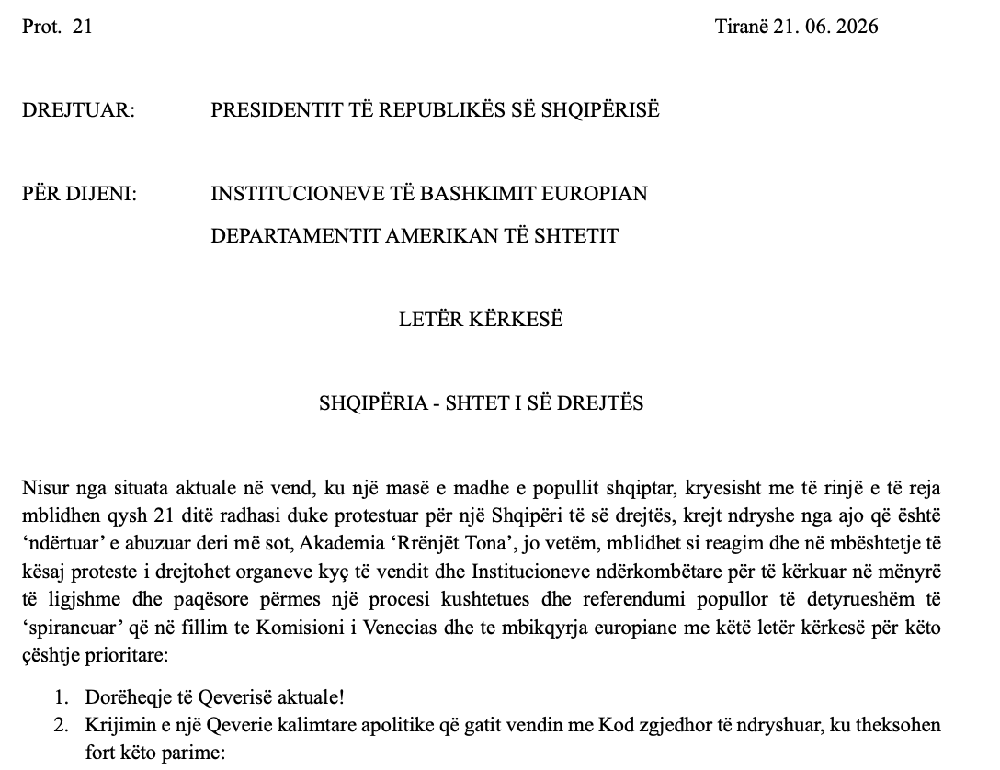

# 🦩 FLAMINGO REVOLUTION

### Dokumentim Faktesh &nbsp;·&nbsp; Analiza Ligjore &nbsp;·&nbsp; Kronologji Shkeljesh &nbsp;·&nbsp; Deklarata &nbsp;·&nbsp; Referendum

[← Kthehu në faqen kryesore](../README.md)

---

### Përmbajtja

1. [📜 Deklarata e Akademikëve të Diasporës](#-1-deklarata-e-akademikëve-të-diasporës)
2. [✉️ Letër e Hapur Drejtuar Bashkimit Europian](#️-2-letër-e-hapur-drejtuar-bashkimit-europian)
3. [📄 Letër Kërkesë Drejtuar Presidentit](#-3-letër-kërkesë-drejtuar-presidentit-të-republikës)

---

## 📜 1. Deklarata e Akademikëve të Diasporës

**"Arsimi, Shkenca dhe Inovacioni — Domosdoshmëri Kombëtare"**

Deklaratë publike e 213+ akademikëve shqiptarë jashtë vendit — nga Evropa, Amerika e Veriut, Australia dhe rajone të tjera — që shprehin solidaritet me protestat qytetare në Shqipëri dhe kërkojnë reforma institucionale të bazuara në llogaridhënie, transparencë dhe drejtësi.

→ **[Hap faqen e plotë dhe nënshkruaj](https://diaspora-akademike.org/deklarate.php?ok=1#shto)**

**[→ Hap faqen e plotë dhe nënshkruaj deklaratën](https://diaspora-akademike.org/deklarate.php?ok=1#shto)**

---

## ✉️ 2. Letër e Hapur Drejtuar Bashkimit Europian

**IASEE–RISE — Innovative Alliance of South-East Europe**

Peticion i drejtuar Institucioneve të Bashkimit Europian nga aleanca IASEE–RISE, që kërkon vëmendjen ndërkombëtare ndaj situatës në Shqipëri dhe mbështetje për kërkesat legjitime të qytetarëve shqiptarë për sundimin e ligjit dhe reforma demokratike.

→ **[Hap peticionin dhe nënshkruaj](https://ia-see.com/peticioni/)**

**[→ Hap faqen e plotë dhe nënshkruaj letrën](https://ia-see.com/peticioni/)**

---

## 📄 3. Letër Kërkesë Drejtuar Presidentit të Republikës

**"Shqipëria — Shtet i së Drejtës"**

Letër zyrtare (Prot. 21, datë 21.06.2026) nga **Akademia 'Rrënjët Tona'** drejtuar Presidentit të Republikës së Shqipërisë, me kopje Institucioneve të BE-së dhe Departamentit Amerikan të Shtetit.

### Kërkesat kryesore:

1. **Dorëheqje e Qeverisë aktuale**
2. **Qeveri kalimtare apolitike** — me Kod zgjedhor të ndryshuar: Parlament me dy Dhoma (100 deputetë + 20 Senatorë), komisione jo-politike, lista të hapura, votë e lirë e diasporës
3. **Abrogim i Kushtetutës së 2008** — që mundësoi tjetërsimin e kufijve detarë (Karaburun–Butrint, etj.), ligjin e investimeve strategjike në dëm të publikut, mungesa e mbrojtjes sociale
4. **Parime bazë të qeverisjes** — ruajtja e sovranitetit shtetëror dhe kombëtar, riformatim i drejtësisë, shfrytëzim i burimeve natyrore në interes të popullit
5. **Ndryshime kushtetuese** — zgjedhja e Presidentit me pjesëmarrje popullore, ndalim i kryeministrit nga të qenurit kryetar partie, ligj i pastër për referendume, mbrojtje e hapësirave publike dhe bregdetit

→ **Klikoni mbi imazh për të hapur PDF-në e plotë**

**[📄 Hap PDF-në e plotë](deklarate-per-protesten.pdf)**

