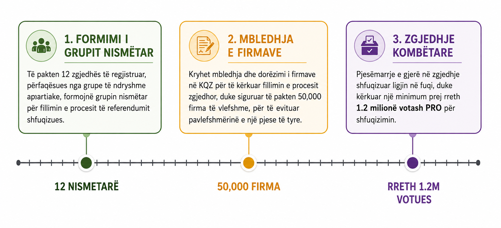

# Letër ftesë për tu bërë pjesë e 12 nismëtarëve për referendum

Ne, si qytetarë të mërgatës shqiptare dhe aktivistë nga Shqipëria, jemi thellësisht të bindur se rrethanat historike në të cilat ndodhet vendi e bëjnë të domosdoshme ndërmarrjen e një nisme qytetare për fillimin e procedurës së referendumit mbi shfuqizimin e Ligjit 21/2024 "Për disa shtesa dhe ndryshime në Ligjin nr. 81/2017". Sqarojmë se ky ligj nuk është pjesë e nismave të tjera ligjore që janë aktualisht në proces referendumi.

Kjo lind si një nismë e mirëfilltë qytetare dhe tërësisht jopartiake. Në gjithë historinë e Shqipërisë, me përjashtim të lëvizjes qytetare kundër importit të mbetjeve në vitin 2012 (e cila u mbështet edhe nga parti politike), nuk ka pasur asnjë referendum të nisur drejtpërdrejt nga vullneti i lirë i qytetarëve. Të gjitha referendumet e zhvilluara deri më sot kanë ardhur nga iniciativa e forcave politike. Besojmë se ky është momenti i duhur që, nëpërmjet këtij referendumi, të krijojmë një precedent të ri demokratik – një të drejtë që na e garanton vetë Kushtetuta e Shqipërisë (nenet 150–152).

Për të nisur formalisht procedurat e referendumit kërkohet ngritja e një grupi prej të paktën 12 nismëtarësh. Sipas parimeve tona, ky grup duhet të përfaqësojë frymën qytetare dhe integritetin e kësaj nisme. Për këtë arsye nismëtarët duhet të përmbushin këto kritere bazë:

- të kenë profil apartiakë,
- të kenë kurajo civile,
- të gëzojnë reputacion të mirë publik,
- të mos kenë konflikte interesi.

Për më tepër informacione mbi procesin e detajuar të referendumit mund të vizitoni faqen:
[Referendum për Ligjin 21/2024](https://github.com/gledguri/Flamingo_Revolution/blob/main/Referendum/README.md)

*Figura 1. Infografik përmbledhës (i shkurtuar) mbi procesin e referendumit.*

## Çfarë synon të arrijë kjo nismë?

### 1. Të ushtrojë presion institucional ndaj qeverisë

Deklaratat e Kryeministrit gjatë Konferencës së përbashkët për shtyp me Komisioneren e zgjerimit te BE-së, Marta Kos, nuk përmbajnë një afat apo garanci konkrete se kur kjo do të ndodhë. Pa një mekanizëm shtesë presioni (referendumi për shfuqizim te ligjit), ekziston rreziku që procesi të zvarritet për aq kohë sa t'i shërbejë interesave politike të momentit. Referendumi është një instrument kushtetues dhe legjislativ që i jep qytetarëve mundësinë të bëhen pjesë e bashkëqeverisjes (në rastin konkret për shfuqizimin e ktij ligji) si dhe te ushtrojnë presion të drejtpërdrejtë juridik mbi institucionet, duke plotësuar protestat dhe format e tjera të angazhimit qytetar.

Përvoja e vitit 2012 për importin e mbetjeve (nga shoqëria civile) tregoi se edhe vetë procesi i mbledhjes së 50.000 firmave mund të prodhojë rezultat konkret: Parlamenti vendosi ta shfuqizonte ligjin përpara se referendumi të zhvillohej. Ishte një fitore e arritur përmes mobilizimit qytetar. Pra, referendumi nuk shërben vetëm për rezultatin përfundimtar, por edhe si presion.

### 2. Të edukojë dhe fuqizojë qytetarët

Referendumi është e drejtë kushtetuese e vullnetit qytetar (nuk është vetëm vota 1 në 4 vjet) dhe ne nuk e kemi ushtruar ASNJËHERË! Ai është një proces që i mëson qytetarët të organizohen, të bashkëpunojnë dhe të ushtrojnë një nga të drejtat më të rëndësishme kushtetuese që kanë.

Shqipëria është ndër vendet evropiane me përdorimin më të ulët të referendumit. Deri më sot janë zhvilluar vetëm 3 referendume (94, 97 dhe 98), të gjitha të iniciuara nga partitë politike. Pra, nuk kemi asnjë referendum nga vetë qytetarët (përveç atij të vitit 2012, të nisur nga shoqëria civile me mbështetjen e partive politike).

Duhet të mësojmë të organizohemi për ta çuar popullin drejt referendumeve – dhe ky është momenti i duhur për ta kthyer këtë përvojë në mësim dhe në forcë për të ardhmen.

### 3. Të evidentojë mangësitë e kuadrit ligjor për referendumet

Referendumi është e vetmja formë e drejtpërdrejtë e vendimmarrjes që Kushtetuta u garanton qytetarëve. Megjithatë, kur kushtet për ushtrimin e kësaj të drejte janë praktikisht të paarritshme, ajo mbetet vetëm një e drejtë formale (de jure) dhe jo një e drejtë reale (de facto).

Procesi i referendumit është në vetvete mjaft i vështirë, dhe vendosja e një pragu pjesëmarrjeje qytetare prej 33% përbën një kriter tepër të lartë. Duhet pasur parasysh se vetë Parlamenti shqiptar është zgjedhur me një pjesëmarrje qytetare prej 44%, ndërsa në zgjedhjet e fundit vendore pjesëmarrja ishte 38%. Kjo tregon se arritja e një pragu të tillë në një proces votimi të drejtpërdrejtë është një sfidë e vështirë. Po ashtu, kriteri i mbledhjes së 50.000 mijë firmave për të iniciuar referendumin qytetar është mjaft i lartë. Duke pasur parasysh se në zgjedhjet e fundit parlamentare të vitit 2025 nevojiteshin rreth 12.000 vota të vlefshme për të siguruar një mandat deputeti, ky krahasim evidenton një disbalancë të konsiderueshme. Kjo është e papranueshme! Gjatë procesit të referendumit, këto argumente mund të shërbejnë si elemente provuese për të vlerësuar nëse kriteret ekzistuese krijojnë një pengesë disproporcionale ndaj pjesëmarrjes qytetare dhe, nëse do të jetë e nevojshme, për t'iu drejtuar institucioneve apo organizatave ndërkombëtare që merren me mbrojtjen e demokracisë dhe të të drejtave të njeriut.

## Përfundimi

Pikërisht për këtë arsye, kjo nismë nuk synon vetëm shfuqizimin e një ligji. Ajo synon të tregojë në praktikë se ku pengohet demokracia e drejtpërdrejtë në Shqipëri dhe të hapë një debat serioz mbi nevojën për ta bërë të drejtën e referendumit realisht të ushtrueshme nga qytetarët. Këto rrugë ose i hapim ne sot, ose mbeten të mbyllura edhe për brezat që vijnë.

## Përbërja e grupit nismëtar

Besojmë se grupi prej minimumi 12 nismëtarësh duhet të përfaqësojë sa më denjësisht shoqërinë shqiptare dhe të simbolizojë bashkimin e qytetarëve përtej bindjeve politike. Për këtë arsye, propozojmë që ai të përbëhet nga katër shtylla përfaqësimi, me nga tre persona secila:

- **3 pjesëmarres të protestës**, si nismëtarët e angazhimit qytetar (aktiviste, studente, influencers);
- **3 përfaqësues të shoqërisë civile mjedisore** (p.sh. EcoAlbania, PPNEA etj.), me eksperiencë në mbrojtjen e interesit publik;
- **3 përfaqësues të diasporës shqiptare**, si zëri i shqiptarëve jashtë vendit;
- **3 figura publike me integritet dhe besueshmëri**, të njohura për kontributin e tyre në shoqëri.

Gjithashtu kërkojmë që 12 nismëtarët të nënshkruajnë dy deklarata angazhimi me përmbajtjen e mëposhtme:

### Deklarata I e Nismëtarëve

> "Ne, nismëtarët e kësaj nisme qytetare për referendum, angazhohemi të veprojmë me ndershmëri, pavarësi, transparencë dhe përgjegjësi publike. Vendosim interesin kombëtar dhe vullnetin e qytetarëve mbi çdo interes personal, partiak apo grupor dhe zotohemi ta çojmë këtë proces deri në përfundimin e tij, duke respektuar Kushtetutën, ligjin dhe parimet demokratike."

### Deklarata II e Nismëtarëve

> "Ne, nismëtarët e kësaj nisme qytetare, deklarojmë se kjo nismë është tërësisht qytetare dhe e pavarur dhe nuk do të përdoret apo kanalizohet, në asnjë fazë të saj, për krijimin, mbështetjen ose promovimin e subjekteve politike apo interesave partiake. Me përfundimin e procesit të referendumit, pavarësisht rezultatit të tij, kjo nismë do të konsiderohet e përmbushur dhe do të shpërbëhet, pa vijuar aktivitet në asnjë formë organizative apo politike."

## 12 cilësitë për 12 nismëtarët

Për të garantuar besueshmërinë, integritetin dhe karakterin tërësisht qytetar të nismës, 12 nismëtarët duhet të plotësojnë kriteret e mëposhtme:

1. Të jenë qytetarë apartiakë, pa funksione drejtuese apo përfaqësuese në parti politike gjatë mandatit të kësaj nisme.
2. Të jenë qytetarë aktivë, duke përfaqësuar komunitetin, profesionet, akademinë, sipërmarrjen, aktivizmin qytetar ose diasporën, dhe jo struktura partiake.
3. Të kenë integritet të lartë moral dhe publik, me reputacion të mirë në komunitetin ku jetojnë dhe veprojnë.
4. Të kenë një histori të dokumentuar aktivizmi qytetar, kontributesh publike ose angazhimi në çështje të interesit shoqëror dhe kombëtar.
5. Të mos kenë precedentë penalë, të mos jenë dënuar për vepra penale dhe të mos jenë subjekt i proceseve që cenojnë besueshmërinë e tyre publike.
6. Të mos kenë konflikte interesi që mund të ndikojnë në pavarësinë e vendimmarrjes së tyre.
7. Të nënshkruajnë një Pakt Angazhimi, me të cilin marrin përsipër ta çojnë procesin e referendumit deri në përfundimin e tij, me përkushtim dhe përgjegjësi.
8. Të respektojnë etikën e komunikimit publik, duke promovuar dialogun, respektin, transparencën dhe refuzimin e gjuhës së urrejtjes, shpifjes apo përçarjes.
9. Të udhëhiqen nga parime të larta kombëtare, duke vendosur interesin publik, sovranitetin, demokracinë, shtetin e së drejtës dhe mirëqenien e qytetarëve mbi çdo interes personal apo grupor.
10. Të angazhohen për transparencë të plotë, duke informuar rregullisht publikun mbi ecurinë e nismës dhe vendimmarrjet kryesore.
11. Të marrin vendime në mënyrë kolegjiale, duke respektuar mendimin e shumicës dhe duke shmangur kultin e individit apo përqendrimin e kompetencave.
12. Të jenë të përgjegjshëm dhe llogaridhënës ndaj qytetarëve, duke pranuar të japin shpjegime publike për vendimet, veprimet dhe qëndrimet e marra gjatë gjithë procesit të referendumit.

## Deklarata e grupit për formimin e 12 nismëtarëve

Angazhimi i këtij grupi të përbërë nga pjesëtarë të mërgatës shqiptare dhe aktivistë nga Shqipëria përfundon në momentin kur grupi prej 12 nismëtarëve nënshkruan dhe depoziton kërkesën për referendum pranë Komisionit Qendror të Zgjedhjeve (KQZ). Me përmbushjen e këtij misioni, ky grup konsiderohet i shpërndarë dhe nuk do të ushtrojë më rol komunikues apo përfaqësues për nismën. Që nga ai moment, të gjitha përgjegjësitë publike, institucionale dhe komunikuese që lidhen me referendumin i kalojnë ekskluzivisht grupit të 12 nismëtarëve.

## Angazhimi dhe detyrat e nismëtarëve

Nismëtarët do të kenë si detyrë kryesore nënshkrimin dhe depozitimin e kërkesës për referendum pranë Komisionit Qendror të Zgjedhjeve (KQZ), si dhe ndjekjen e të gjitha procedurave ligjore që lidhen me të. Përgjatë procesit, ata do të angazhohen në koordinimin e fushatës për mbledhjen e 50.000 firmave, në komunikimin publik dhe transparent të ecurisë së nismës, si dhe në përfaqësimin e saj përballë institucioneve dhe medias. Vendimet do të merren në mënyrë kolegjiale dhe çdo nismëtar pritet të kontribuojë me kohën, përvojën dhe rrjetin e tij qytetar, deri në përmbushjen e plotë të procesit të referendumit.

## Shprehja e interesit

Ju lutem shprehni interesin nëpërmjet këtij formulari:

