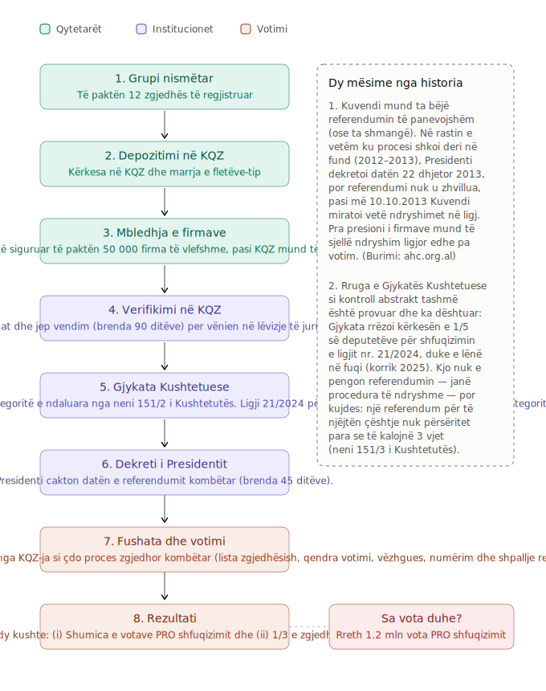

# 🦩 FLAMINGO REVOLUTION

### Dokumentim Faktesh &nbsp;·&nbsp; Analiza Ligjore &nbsp;·&nbsp; Kronologji Shkeljesh &nbsp;·&nbsp; Deklarata &nbsp;·&nbsp; Referendum

[← Kthehu në faqen kryesore](../README.md)

---

## 🗳️ Referendumi Shfuqizues për Ligjin Nr. 21/2024

### ⚖️ Baza ligjore

Populli, nëpërmjet 50 mijë shtetasve me të drejtë vote, ka të drejtën e referendumit për shfuqizimin e një ligji. Referendumet zhvillohen sipas neneve 108 pika 4, 150, 151, 152 dhe 177 të Kushtetutës dhe rregullave të parashikuara në Kodin Zgjedhor (ligji nr. 9087, datë 19.06.2003) — pjesa e referendumeve e këtij kodi ka mbetur në fuqi, pasi Shqipëria ende nuk ka miratuar një ligj të posaçëm "Për Referendumet".

- **Kushtetuta e Republikës së Shqipërisë**, nenet **150, 151 dhe 152**.
- **Kodi Zgjedhor**, ligji nr. **9087, datë 19.06.2003** — Pjesa e Nëntë “Referendumet” (nenet 118–131). Kjo pjesë **mbetet ende në fuqi**, sipas nenit 185, pika 2, të Kodit Zgjedhor aktual (ligji nr. 10 019, datë 29.12.2008), derisa Kuvendi të miratojë një ligj të ri të posaçëm për referendumet.

---

### 📌 Pse referendum — dhe pse tani

Ligji Nr. 21/2024 “Për disa shtesa dhe ndryshime në ligjin nr. 81/2017 “Për zonat e mbrojtura”” hapi derën për ndërtimin e strukturave turistike “5 yje” dhe të infrastrukturës mbështetëse brenda zonave të mbrojtura, duke zëvendësuar ndalime të qarta (“nuk lejohet”, “ndalohet”) me koncepte më elastike (“kufizim”, “zhvillim i qëndrueshëm”).

Në datën **31.07.2025**, Gjykata Kushtetuese (vendimi nr. 45/2025, V-45/25 — shih [Documents/vend.4525.pdf](Documents/vend.4525.pdf)) **rrëzoi me shumicë votash** kërkesën e 37 deputetëve për shfuqizimin e ligjit si antikushtetues. Tre nga tetë gjyqtarët e Gjykatës dhanë mendim pakice në favor të shfuqizimit, por vendimi është **përfundimtar** dhe ka hyrë në fuqi me botimin në Fletoren Zyrtare (shpallur 31.10.2025).

**Kjo do të thotë që rruga e kontrollit kushtetues abstrakt (nëpërmjet deputetëve) është mbyllur.** Mjeti i vetëm i mbetur, i detyrueshëm dhe i nisur nga qytetarët, për të shfuqizuar ligjin, është **referendumi popullor** sipas nenit 150, pika 1, të Kushtetutës. (Shih edhe krahasimin e katër mjeteve të qytetarëve te [Mekanizmat/README.md](../Mekanizmat/README.md).)

---

### 🖼️ Diagrami i procesit

---

## 📅 Hapat Kronologjikë

### 1️⃣ Formimi i grupit nismëtar
Kërkesa për fillimin e procedurave të referendumit shfuqizues paraqitet në KQZ nga një grup prej jo më pak se 12 nismëtarësh (neni 126, pika 2, Kodi Zgjedhor), të cilët duhet të jenë zgjedhës të regjistruar në Regjistrin Kombëtar të Zgjedhësve. Kërkesa duhet të përcaktojë qartë objektin: shfuqizimin e Ligjit nr. 21/2024 në tërësinë e tij.

**Çfarë bëhet:** Grupi mblidhet dhe firmos një **procesverbal themelues**, ku përcaktohet qëllimi (shfuqizimi i ligjit 21/2024) dhe pyetja që do t'u shtrohet zgjedhësve.
**Dokument gati për përdorim:** [Procesverbal i grupit nismëtar - 21 2024.docx](Documents/Procesverbal%20i%20grupit%20nismëtar%20-%2021%202024.docx)

### 2️⃣ Depozitimi i kërkesës në KQZ
Grupi nismëtar regjistron kërkesën në Komisionin Qendror të Zgjedhjeve dhe pajiset prej tij me fletët-tip zyrtare për mbledhjen e nënshkrimeve. Praktika e mëparshme tregon se nismëtarët i kërkojnë KQZ-së t'i pajisë me fletët tip për grumbullimin e firmave — firmat e mbledhura jashtë këtyre fletëve nuk njihen. 

**Çfarë duhet të përmbajë kërkesa** (neni 126, pika 4, Kodi Zgjedhor):
- titullin, numrin dhe datën e miratimit të ligjit që kërkohet të shfuqizohet (Ligji Nr. 21/2024);
- arsyet pse ligji duhet të shfuqizohet;
- pyetjen që do t'u shtrohet zgjedhësve, e formuluar qartë, plotësisht dhe pa ekuivoke, në mënyrë që të përgjigjen me “PO” ose “JO”.

**Dokument gati për përdorim:** [Kërkesë per KQZ per mbledhjen e firmave per referendum - 21 2024.docx](Documents/Kërkesë%20per%20KQZ%20per%20mbledhjen%20e%20firmave%20per%20referendum%20-%2021%202024.docx) — kërkesa formulon pyetjen: *“A jeni dakord ju personalisht që Ligji Nr. 21/2024 … të shfuqizohet?”*

> ℹ️ Kërkesa për shfuqizimin e **vetëm një pjese** të ligjit pranohet nga KQZ vetëm nëse pjesa tjetër mbetet e vetëmjaftueshme (neni 126, pika 3). Në rastin tonë kërkohet shfuqizimi i të gjithë ligjit, kështu që kjo kufizim nuk zbatohet.

### 3️⃣ Pajisja me fletët-tip për mbledhjen e firmave
KQZ-ja, **brenda 20 ditëve** nga paraqitja e kërkesës, pajis grupin nismëtar (kundrejt pagesës) me fletët-tip zyrtare për mbledhjen e nënshkrimeve (neni 127, pika 1). Në krye të çdo fletoreje shtypet titulli i ligjit dhe pyetja e referendumit.

### 4️⃣ Mbledhja e 50.000 firmave
Mblidhen 50.000 firma sipas nenit 150, pika 1, Kushtetuta; neni 126, pika 1, Kodi Zgjedhor. Nënshkruesit duhet të jenë shtetas me të drejtë vote, të regjistruar në listat e zgjedhësve, me të dhëna të sakta identifikimi (emër, numër dokumenti, nënshkrim). Këshillohet të mblidhen dukshëm më shumë se 50.000 firma (p.sh. 70–100 mijë), sepse një pjesë skualifikohen gjatë verifikimit. Në precedentin e vitit 2012 (referendumi kundër importit të plehrave), KQZ-ja konstatoi parregullsi në nënshkrime, por numri i zgjedhësve që kishin nënshkruar mbeti mbi 50.000, në përmbushje të kërkesës kushtetuese. 

**Afati kohor:** Firmat depozitohen në KQZ **vetëm midis 1 janarit dhe 30 nëntorit** të çdo viti (neni 127, pika 2). Firmat jashtë kësaj periudhe nuk pranohen.

### 5️⃣ Verifikimi nga KQZ
Brenda 90 ditëve nga depozitimi i kërkesës së grupit nismëtar, KQZ verifikon firmat e mbi 50.000 zgjedhësve, saktësinë e dokumenteve të identifikimit dhe rregullsinë e dokumentacionit, dhe më pas vendos me vendim të arsyetuar pranimin ose jo të kërkesës për zhvillimin e referendumit (neni 128, pika 1). Në rast mospranimi, vendimi duhet të shpjegojë qartë arsyet.

**Mundësia për korrigjim:** Nëse ka parregullsi, grupi nismëtar mund të njoftojë KQZ-në brenda **5 ditëve** se është gati t'i korrigjojë. KQZ-ja jep deri në **30 ditë** për ripërsëritje dhe vendos brenda **10 ditëve** të tjera mbi kërkesën e ripërsëritur (neni 128, pika 3).

### 6️⃣ Përcjellja te Gjykata Kushtetuese dhe Presidenti
Vendimi i KQZ-së për pranimin e kërkesës përbën mjetin për vënien në lëvizje të juridiksionit kushtetues. KQZ-ja ia përcjell kërkesën Presidentit të Republikës dhe Gjykatës Kushtetuese, dhe njofton njëkohësisht Kryetarin e Kuvendit dhe Kryeministrin (neni 129, pika 1).

### 7️⃣ Kontrolli paraprak i kushtetutshmërisë nga Gjykata Kushtetuese
Në Gjykaten Kushtetuese kontrollohet nëse ligji hyn te kategoritë e ndaluara nga neni 151/2 i Kushtetutës (tërësia territoriale, kufizimi i lirive dhe të drejtave themelore, buxheti, taksat e detyrimet financiare të shtetit, gjendja e jashtëzakonshme, lufta e paqja, amnistia). Një ligj për zonat e mbrojtura nuk bën pjesë në kategoritë e ndaluara nga neni 151/2 i Kushtetutës (Gjykata e ka konfirmuar këtë logjikë në 2013, kur deklaroi të pajtueshme me Kushtetutën kërkesën për referendum shfuqizues të neneve të ligjit "Për menaxhimin e integruar të mbetjeve", pasi ato nuk i përkisnin kategorive të ndaluara).

**Afati kohor:** 60 ditë.

> ⚠️ **Kujdes:** Kjo është faza më kritike. Formulimi i pyetjes duhet të jetë i qartë, i plotë dhe të mos cenojë asnjë nga çështjet e ndaluara nga referendumi sipas nenit 151, pika 2, të Kushtetutës (tërësia territoriale, kufizimi i lirive/të drejtave themelore, buxheti, taksat, gjendja e jashtëzakonshme, lufta/paqja, amnistia). Shfuqizimi i një ligji mjedisor si Ligji 21/2024 **nuk përfshihet** në këto ndalime.

### 8️⃣ Caktimi i datës nga Presidenti
Presidenti i Republikës cakton datën e referendumit **brenda 45 ditëve** nga shpallja e vendimit pozitiv të Gjykatës Kushtetuese, ose nga kalimi i afatit brenda të cilit ajo duhej të shprehej (neni 152, pika 3, Kushtetuta; neni 130, Kodi Zgjedhor). Referendumet zhvillohen **vetëm një ditë** gjatë vitit.

**Afati kohor:** 45 ditë.

### 9️⃣ Fushata dhe dita e votimit
Referendumi administrohet nga KQZ-ja nëpërmjet komisioneve zonale, sipas rregullave të parashikuara për zgjedhjet e Kuvendit, aq sa është e mundur ose e nevojshme (neni 120, pika 1). Ky proçes është si çdo proces zgjedhor kombëtar: lista zgjedhësish, qendra votimi, vëzhgues, numërim dhe shpallje rezultati.

### 🔟 Rezultati dhe hyrja në fuqi
Në referendum konsiderohet fituese alternativa që ka fituar shumicën e votave të vlefshme, por jo më pak se një të tretën e numrit të zgjedhësve të regjistruar në Listën e Zgjedhësve (neni 118, pika 3). Nëse alternativa "PRO shfuqizimit" i plotëson të dyja kushtet, ligji 21/2024 shfuqizohet me efektin e rezultatit të shpallur.

**Kur hyn në fuqi shfuqizimi:** Menjëherë me shpalljen e rezultatit — përveçse nëse Kuvendi, me kërkesë të arsyetuar të Këshillit të Ministrave, vendos shtyrjen e shfuqizimit, por jo për më shumë se **60 ditë** (neni 121, pika 2).

---

## ⏳ Afate dhe kufizime që duhen mbajtur parasysh

| Rregull | Përmbajtja | Baza ligjore |
|---|---|---|
| **Dritarja e depozitimit** | Firmat depozitohen vetëm 1 janar – 30 nëntor | Neni 127/2, Kodi Zgjedhor |
| **Afati kufi vjetor** | Nëse procedura nuk përfundon deri më **15 mars** të një viti, kërkesa shtyhet automatikisht për vitin pasardhës | Neni 119/6, Kodi Zgjedhor |
| **Ndalimi rreth zgjedhjeve** | Referendumi nuk mund të zhvillohet në ditën e zgjedhjeve për Kuvendin/organet vendore, as gjatë periudhës nga 6 muaj para përfundimit të mandatit të Kuvendit deri 3 muaj pas mbledhjes së parë të Kuvendit të ri | Neni 119/1–2, Kodi Zgjedhor |
| **Pragu i vlefshmërisë** | Shumicë e votave të vlefshme + jo më pak se 1/3 e zgjedhësve të regjistruar | Neni 118/3, Kodi Zgjedhor |
| **Mospërsëritja** | Referendumi për të njëjtën çështje nuk përsëritet brenda 3 vjetësh nga zhvillimi i tij | Neni 151/3, Kushtetuta |
| **Çështje të ndaluara** | Territori, të drejtat themelore, buxheti/taksat, gjendja e jashtëzakonshme, lufta/paqja, amnistia — nuk zbatohet për Ligjin 21/2024 | Neni 151/2, Kushtetuta |

---

## 📁 Dokumentet e disponueshme

| Dokument | Përshkrimi |
|---|---|
| [Kërkesë per KQZ ... - 21 2024.pdf](Documents/Kërkesë%20per%20KQZ%20per%20mbledhjen%20e%20firmave%20per%20referendum%20-%2021%202024.pdf) | Kërkesa drejtuar KQZ-së për nisjen e procedurave dhe pajisjen me fletët-tip |
| [Procesverbal i grupit nismëtar - 21 2024.pdf](Documents/Procesverbal%20i%20grupit%20nismëtar%20-%2021%202024.pdf) | Procesverbali themelues i grupit prej 12 nismëtarëve |
| [vend.4525.pdf](Documents/vend.4525.pdf) | Vendimi nr. 45/2025 (V-45/25) i Gjykatës Kushtetuese, që rrëzoi kërkesën e deputetëve dhe la referendumin si rrugën e mbetur |

---

## 🔗 Burime

- [Kushtetuta e Republikës së Shqipërisë — nenet 150–152](https://www.mod.gov.al/images/akteligjore/kushtetuta/Kushtetuta-e-REPUBLIKES-SE-SHQIPERISE.pdf)
- [Kodi Zgjedhor — teksti i konsoliduar (KQZ)](https://kqz.gov.al/pdf/kodi-zgjedhor.pdf)
- [Krahasimi i katër mjeteve ligjore të qytetarëve](../Mekanizmat/README.md)

---

Presim me shume information nga Dorina Prethi
[kontakto](mailto:gled.guri@gmail.com)
